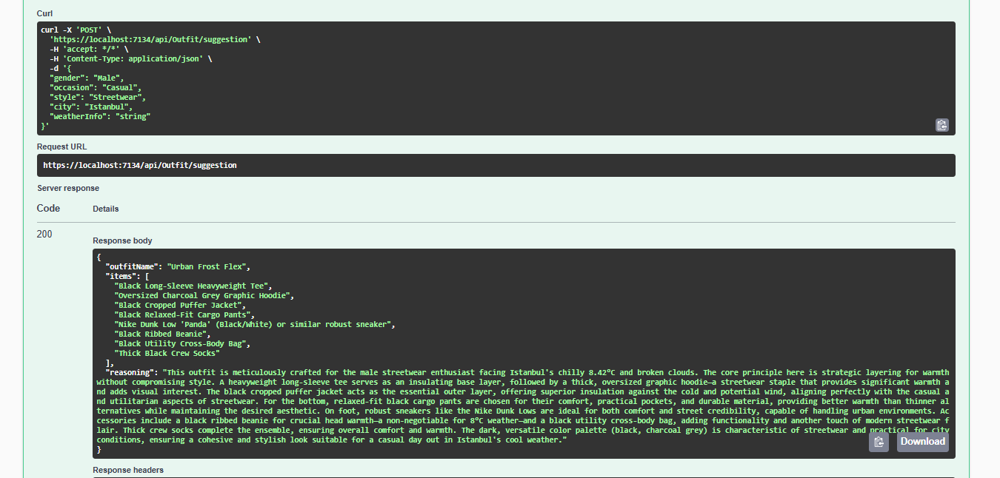

# What Should I Wear? 👕🌦️

An AI-powered outfit recommendation API built with **.NET 8**. 
It orchestrates **OpenWeatherMap** and **Google Gemini AI** to suggest the perfect outfit based on real-time weather conditions, location, and user style preferences.

<div align="center">
  
</div>

## 🚀 Features

* **Real-time Weather Analysis:** Fetches live weather data (temperature, condition) for any city via OpenWeatherMap.
* **AI-Driven Styling:** Uses Google Gemini 2.5 Flash model to generate context-aware fashion advice.
* **Smart Orchestration:** Combines structured user data with unstructured weather data to create meaningful prompts.
* **Clean Architecture:** Designed with separation of concerns in mind.

## 🛠️ Tech Stack & Best Practices

* **Framework:** .NET 8 Web API
* **AI Model:** Google Gemini 2.5 Flash
* **Http Client:** `IHttpClientFactory` with Typed Clients (Resilience & Performance)
* **Configuration:** Options Pattern (Strongly typed configuration)
* **Architecture:** Service-Repository Pattern (Simplified)
* **Documentation:** Swagger / OpenAPI

## ⚙️ Installation & Setup

1.  **Clone the repository**
    *(Kendi kullanıcı adını buraya yazmayı unutma)*
    ```bash
    git clone [https://github.com/KULLANICI_ADIN/WhatShouldIWear.git](https://github.com/KULLANICI_ADIN/WhatShouldIWear.git)
    ```

2.  **Configure API Keys**
    * Get a free API Key from [OpenWeatherMap](https://openweathermap.org/api).
    * Get a free API Key from [Google AI Studio](https://aistudio.google.com/).
    * Update `appsettings.Development.json`:
    ```json
    "OpenWeather": {
      "ApiKey": "YOUR_WEATHER_API_KEY",
      "BaseUrl": "[https://api.openweathermap.org/data/2.5/](https://api.openweathermap.org/data/2.5/)"
    },
    "Gemini": {
      "ApiKey": "YOUR_GEMINI_API_KEY",
      "BaseUrl": "[https://generativelanguage.googleapis.com/v1beta/models/gemini-2.5-flash:generateContent](https://generativelanguage.googleapis.com/v1beta/models/gemini-2.5-flash:generateContent)"
    }
    ```

3.  **Run the application**
    ```bash
    dotnet run
    ```

4.  **Try it out**
    Navigate to `https://localhost:7134/swagger` and send a POST request to `/api/outfit/suggestion`.

## 📝 Usage Example

**Request:**
```json
{
  "city": "Istanbul",
  "gender": "Male",
  "occasion": "Casual",
  "style": "Streetwear"
}

**Response:**
```json
{
  "outfitName": "Urban Frost Flex",
  "items": [
    "Black Long-Sleeve Heavyweight Tee",
    "Nike Dunk Low 'Panda'",
    "Black Cropped Puffer Jacket",
    "Black Relaxed-Fit Cargo Pants",
    "Black Ribbed Beanie"
  ],
  "reasoning": "This outfit is meticulously crafted for the male streetwear enthusiast facing Istanbul's chilly 8.42°C..."
}